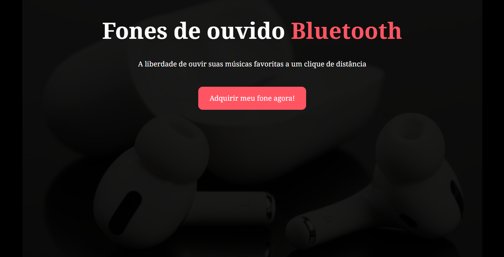
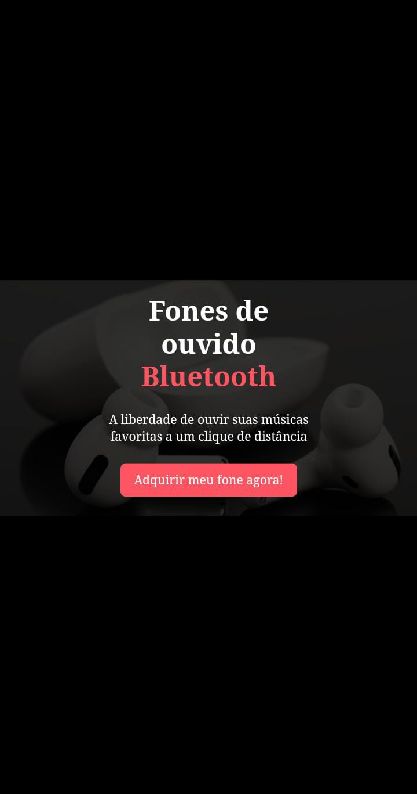

## Landing Page para vendas de Fones de ouvido bluetooth

Essa é uma Landing Page super lindinha e responsiva para vendas de Fones de ouvido bluetooth que construí em uma aula de programação da Rocketseat para iniciantes em desenvolvimento web. Ela foi ensinada pelo Mayk Brito (Maykão).

Nela, pude:

* aprender propriedades de estilização com CSS;
- aprender a fazer animação com CSS para dar efeito de ordem de carregamento dos elementos da página;
* utilizar a API do WhatsApp para redirecionar o visitante para um chat comigo neste App com uma mensagem pré-formulada identificado que ele veio através da página.
##### Visualização da Landing Page: https://cassiasantos.github.io/fones-de-ouvido-bluetooth/

Foi um projeto super divertido de desenvolver e quero aprimorá-lo mais ainda!

#### Versão desktop da LP (Landing Page):

#### Versão mobile da LP (Landing Page):
